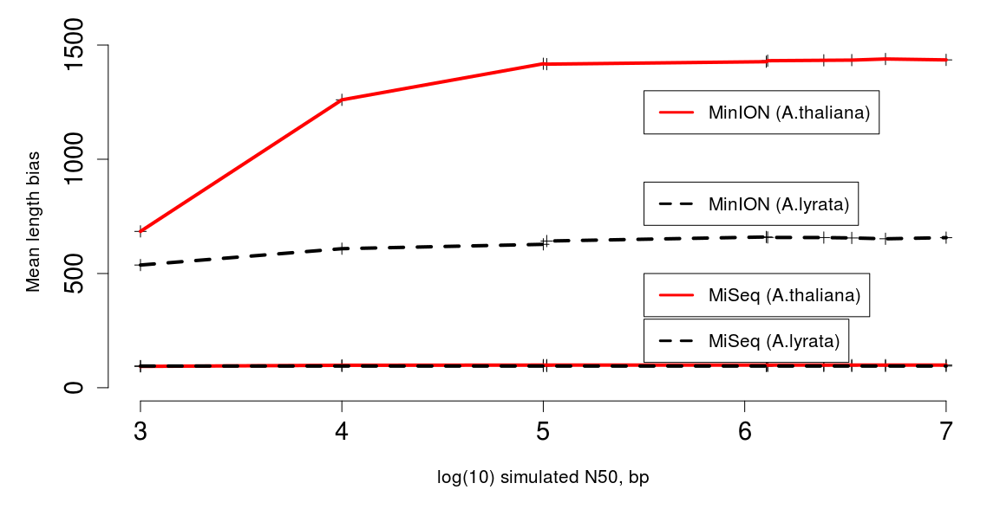

# In-silico genome digests.

## Description
These scripts are used in the Parker _et al._ (2017) paper to simulate poor-contiguity genome assemblies by fragmenting reference (_A. thaliana_ - TAIR10; _A. lyrata_ - 1.0) assemblies in Biopython (.py files, or .ipynb as iPython notebooks). The output data are also listed ([simulate_genome_fragmentation.tdf](simulate_genome_fragmentation.tdf)) as well as the script ([analyse_genome_fragmentation_simulation.r](analyse_genome_fragmentation_simulation.r)) used to generate figures shown in the Extended Data. To run them as parametized you'll need hardcoded file paths to reference data and to use the [shell scripts](../batch_simulate-systematically.sh) in the [parent directory](..).

## Outputs

